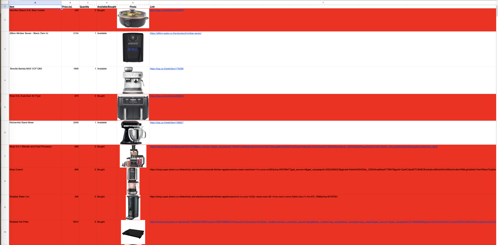

# Benjamin Greenstein | Project Portfolio

### Economics & Entrepreneurship | Data Science | Venture Capital
**[LinkedIn](https://www.linkedin.com/in/benjamin-greenstein-767892335)** | **Herzliya, Israel**

---

## 👋 About Me
I am an **Economics and Entrepreneurship with Data Science** student at **Reichman University**. My professional background includes driving analytical and operational improvements in venture capital, specifically through building structured databases and automating AI-based workflows.

Beyond data, I am building a technical portfolio that spans full-stack web applications, machine learning, and Arduino hardware projects.

---

## 🚀 Interactive Projects (Live Demos)

### 📲 OlehGo: Bureaucracy Navigator
* **The Problem:** Navigating complex governmental and bureaucratic processes independently.
* **The Solution:** A mobile-first application designed to provide step-by-step guidance through bureaucratic tasks.
* **The Tech:** Built using the **Claude API** to provide intelligent, context-aware guidance and automated decision logic for immigrants.
* 🔗 **[Launch Live App](https://oleh-go.vercel.app/)**

### 📊 SmartSpend AI: Receipt Scanner & Budget Tracker
* **The Tech:** Built with **Lovable** and Python, featuring AI-powered OCR.
* **The Logic:** An end-to-end personal finance tool that extracts data from receipt images to automate expense tracking and budget categorisation.
* 🔗 **[Launch Live App](https://aismartspend.lovable.app)**

### 🏎️ F1 Lap Time Predictor
* **The Tech:** **Python**, **FastF1 API**, and **Google Colab**.
* **The Purpose:** A machine learning model that predicts Formula 1 lap times using historical race data, applying statistical modelling and feature engineering.
* 🔗 **[Open Project in Google Colab](https://colab.research.google.com/github/bgreenstein23/bgreenstein23.github.io/blob/main/F1LapTimePredictor.ipynb)**

---

## 🛠️ Other Technical Projects

### 🏗️ Shabbat Elevator Indicator (Patent Pending)
* Designed and built an **Arduino-powered** elevator floor indicator system operating within Shabbat restrictions.
* Includes a working prototype where a rotator changes the displayed floor based on embedded code.
* 🔗 **[View Arduino Source Code](./SEI1.ino)**
* 📽️ **[Watch Prototype Demonstration](./ShabbatElevatorIndicatorPrototype-ezgif.com-optimize%20copy.gif)**

### 📑 Professional Wedding Registry
* Built a custom functional wedding registry tool using **Excel and embedded scripting** for a real-world client.
* 
* 🔗 **[View Scripting Logic](./WeddingRegistryScript.txt)**
---

## ⚙️ Technical Toolkit

| Category | Tools & Technologies |
| :--- | :--- |
| **Programming & Data** | Python, R, SQL, Advanced Excel |
| **AI & Automation** | Claude, ChatGPT, Gemini, Zapier, Prompt Engineering |
| **Dev & Build Tools** | GitHub, Vercel, Lovable, Arduino |
| **Analytics & Modelling** | Econometrics, Statistical Modelling, Machine Learning, Business Intelligence |
| **Business & Finance** | Financial Modelling, FinTech, Product Management |

---

## 🌍 Languages
* **English:** Native
* **Hebrew:** Fluent| **AI & Automation** | Claude, ChatGPT, Gemini, Zapier, Prompt Engineering |
| **Dev & Build Tools** | GitHub, Vercel, Lovable, Arduino |
| **Analytics & Modelling** | Econometrics, Statistical Modelling, Machine Learning, Business Intelligence |
| **Business & Finance** | Financial Modelling, FinTech, Product Management |

---

## 🌍 Languages
* [cite_start]**English:** Native [cite: 41]
* [cite_start]**Hebrew:** Fluent [cite: 41]| **Business & Finance** | Financial Modelling, FinTech, Product Management| **Analytics & Modelling** | Econometrics, Machine Learning, Business Intelligence |
| **Business & Finance** | Financial Modelling, FinTech, Product Management |

---

## 🌍 Languages
* **English:** Native
* **Hebrew:** Fluent| **Analytics & Modelling** | [cite_start]Econometrics, Machine Learning, Business Intelligence [cite: 10] |
| **Business & Finance** | [cite_start]Financial Modelling, FinTech, Product Management [cite: 10] |

---

## 🌍 Languages
* [cite_start]**English:** Native [cite: 41]
* [cite_start]**Hebrew:** Fluent [cite: 41]
